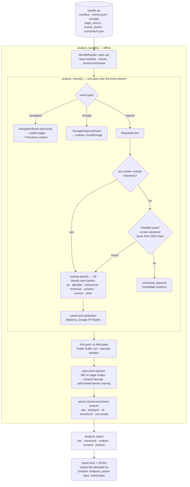

# How analysis works

A high-level map of what `leak-inspector analyze` does. Analysis is **strictly offline**: it reads a capture bundle (including the network posture stored at capture time) and never touches the network itself. Re-probing at analysis time would staple *today's* DNS/TLS onto a session recorded at another moment. Entry point: `analyze_bundle()` in `leak_inspector/analysis/runner.py`.

## What each stage does

**Read the bundle.** `BundleReader` opens the zip and exposes the manifest, the event stream (`events.jsonl`), storage snapshots, saved page source, CNAME chains, and the stored `enrichment.json`. The enrichment is the only source of network-derived posture; an un-enriched bundle still analyzes fine but carries no posture (reports say so and point at the `enrich` command).

**Walk the event stream once.** `analyze_events()` dispatches each event by type. Top-level **navigations** define the pages the visitor was actually on — this is the first-party context. **Storage snapshots** contribute cookies and local/session storage. Each **request** is offered to every registered tracker module via `detect()`: the first module whose `matches()` returns true claims it and `parse()`s it into a `Hit`.

**Classify every parameter.** A module's `parse()` labels each query/body/cookie parameter with a category — `pii`, `identifier`, `behavioral`, `technical`, `consent`, `content`, or `other` — which is what drives the privacy findings downstream.

**Catch the evaders.** A request no module claims by its on-the-wire host gets a second chance: its CNAME chain is resolved to a canonical name and re-tested against the modules. A match here means a tracker is hiding behind first-party DNS to dodge blocklists, and is flagged as such. Anything still unclaimed lands in `untracked_requests` as a candidate tracker for the debug view. A few detectors then do **same-host attribution** (e.g. other requests to a confirmed self-hosted Matomo instance are folded into Matomo).

**Split first-party from third-party.** Hosts are reduced to their registrable domain via the Public Suffix List, then compared against the visited-page domains using operator families (so a site and its own CDN/operator subdomains count as first-party).

**Finish offline.** After the event pass, analysis checks Subresource Integrity on the captured page scripts, decodes consent state, names any self-hosted consent banner found in the saved page source, and finally **attaches the stored enrichment posture** (DNS, transport, TLS, `security.txt`, CMS version probe) — all from the bundle, never the live network.

**Output.** The result is a single `Analysis` object (hits, untracked requests, cookies, consent, posture) that the report layer renders as text and JSON. Repeat hits are deduplicated by `(module, endpoint, parameter-key-set, event-type)`, while the raw in-order stream stays available for drill-down.